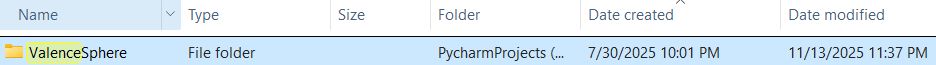

# Valence Sphere

<figure style="width: 560px; max-width: 100%"></figure>

 
ValenceSphere is a two-stage concept-learning and factual-auditing system. Stage 1 builds structured knowledge about individual concepts. Stage 2 provides an ordinary LLM chat while independently checking factual assertions made by both the user and the LLM.

The program does not use machine learning models of its own. It coordinates configured LLM APIs, structured concept templates, persistent audit records and a navigable knowledge graph.

## Core purpose

ValenceSphere is intended to:

* Build focused, reusable concept knowledge.
* Break accepted answers into meaning-bearing semantic constituents.
* Discover related concepts through the spawn system.
* Monitor normal conversation without interfering with it.
* Detect assertions that conflict with learned information.
* Verify disputed assertions using three independent model configurations.
* Preserve the complete reasoning and evidence trail in JSON.
* Reuse previous adjudications when the same assertion appears again.

## Program structure

ValenceSphere has two clearly separated stages.

### Stage 1 — Concept Formation

Stage 1 creates the knowledge that ValenceSphere later uses.

Its tabs are:

* **Library:** create, select, learn and delete concepts.
* **Concept:** inspect the selected concept template and its adjudication activity.
* **Q & A:** complete the focused concept-learning sequence.
* **Analyzer:** use an LLM to break accepted answers into semantic constituents.
* **Spawns:** review and create related concepts extracted during analysis.

Each concept receives one directory containing one live concept template.

```text
ValenceSphere/
└── lemon/
    └── lemon.json
```

The template is updated atomically. ValenceSphere does not create rollover copies or multiple versions of the same concept template.

### Stage 2 — Model Workspace

Stage 2 opens in a separate window.

The left side is an ordinary LLM chat. ValenceSphere does not inject its templates, audits or conclusions into the normal chat request.

After each response appears, ValenceSphere independently scans:

* The user’s input.
* The LLM’s response.

The right side contains:

* **Questioner**
* **Answerer**
* **Adjudicator**
* **Assertion Knowledge Graph**

The background audit does not prevent the chat LLM from answering normally.

## Installation

ValenceSphere requires Python 3.10 or later.

Install the required package:

```bash
python -m pip install -r requirements.txt
```

Start the program:

```bash
python orchestrator.py
```

## API setup

Stage 1 uses these environment variables:

```text
VS_API
VS_MODEL
VS_BASE_URL
```

`OPENAI_API_KEY` can be used instead of `VS_API`.

Only the API key is required when using the default OpenAI endpoint. `VS_MODEL` and `VS_BASE_URL` are optional.

Stage 2 API settings are available from:

```text
File → API Configurations
```

Separate profiles are provided for:

* Chat
* Questioner
* Answerer
* Adjudicator
* Source 1
* Source 2
* Source 3

Each profile can specify:

* Provider label
* Model
* Base URL
* API-key environment variable
* Session-only API key
* Temperature
* Native web-search preference

API keys entered in the GUI remain in memory and are not written to the profile JSON.

Some models only support their default temperature. ValenceSphere automatically retries without the temperature parameter when a provider rejects it.

For completed three-source adjudication, Source 1, Source 2 and Source 3 should use three distinctly identified models.

# Basic usage guide

## 1. Create a concept

Open the **Library** tab.

Enter a concept name, such as:

```text
Lemon
```

Press **Add**.

ValenceSphere creates:

```text
ValenceSphere/lemon/lemon.json
```

Double-click the concept in the Library to open it.

## 2. Learn the concept

Select one or more concepts in the Library and press:

```text
Learn Selected
```

The learning label shows:

* Learning started.
* The concept currently being learned.
* Its position in the selected group.
* Whether learning completed or stopped.

The progress bar provides the overall batch position.

You can also open a concept and use the **Q & A** tab manually.

Press **Prepare Next** to load the next question, then **Send to API**.

The first question establishes the concept definition. Once accepted, that answer is supplied to later questions as explicitly labelled background context.

The context is not appended as though it were part of the new question.

A concept is shown in green in the Library when all 20 learning questions have accepted answers.

## 3. Review the concept

Open the **Concept** tab.

The left tree shows:

* Learning phases
* Question numbers
* Question status
* Answered questions in green

The template area displays the complete concept JSON.

The Activity Log displays Stage 1 adjudications belonging to the selected concept, including:

* Timestamp
* Decision
* Confidence
* Question
* Answer
* Adjudicator reasoning
* Conflicts
* Source log

## 4. Analyze accepted answers

Open the **Analyzer** tab.

Select an answered question and press:

```text
Analyze Selected with API
```

The LLM identifies the answer’s meaning-bearing:

* Core meaning
* Nouns
* Verbs
* Adjectives
* Adverbs
* Noun phrases
* Verb phrases
* Qualifiers
* Semantic relations

The result is saved into the matching question inside the same concept template.

Use:

```text
Analyze All Answered
```

to process every accepted answer. Existing saved analyses can be reused to reconstruct the spawn queue without repeating their API requests.

## 5. Review spawn candidates

Constituent analysis extracts concept-like lexical candidates and adds them to:

```text
ValenceSphere/_global/spawn.json
```

Open the **Spawns** tab to inspect them.

Available controls are:

* **Refresh:** reload the spawn queue.
* **Edit Selected:** correct a candidate before spawning it.
* **Auto Spawn:** create concept templates from queued candidates.
* **Remove Selected:** discard unwanted candidates.

You can also double-click one candidate to edit it.

Editing is useful when plural normalization or constituent extraction produces an incomplete or unsuitable concept name.

Press **Auto Spawn** after reviewing the list. New concepts appear in the Library and can be learned independently.

## 6. Open the Model Workspace

Press:

```text
Open Stage 2 — Model Workspace
```

Configure the APIs from:

```text
File → API Configurations
```

At minimum, configure:

* Chat
* Questioner
* Answerer
* Adjudicator
* Source 1
* Source 2
* Source 3

The three source profiles should identify different models.

## 7. Use normal chat

Type into the chat field and press **Send**.

You can also use:

```text
Ctrl+Enter
```

The chat LLM responds normally. ValenceSphere does not determine or rewrite the response.

After the response appears, background audits begin for both sides of the exchange.

For example:

```text
User: Lemons are red.
Assistant: Lemons are normally yellow.
```

Both assertions are audited independently.

The user card may be marked red while the assistant card is marked green.

## 8. Read the audit

The Questioner:

1. Scans each paragraph for checkable factual assertions.
2. Compresses an assertion into a retrieval subject such as `lemon colour`.
3. Finds the closest concept.
4. Searches the concept template for relevant accepted evidence.
5. Records the result in `socrates_lemon.json`.

Repeated identical evidence is included once with:

* Occurrence count
* Highest stored confidence
* Template section
* Relevant question identifiers

The Answerer:

1. Receives the assertion and Questioner evidence.
2. Compares the assertion only with that evidence.
3. Classifies it as supported, contradicted or insufficient.
4. Records the result in `answerer_lemon.json`.

The Adjudicator:

1. Sends the assertion automatically to Source 1, Source 2 and Source 3.
2. Collects a support position from 0 to 100 from each.
3. Places the three results on a confidence spectrum.
4. Calculates their arithmetic mean.
5. Measures source agreement and verification confidence.
6. Produces the final category and corrected fact.
7. Records the result in `adjudication_lemon.json`.

The reporting LLM may explain the result, but it cannot replace the calculated spectrum or confidence category.

## 9. Read the Knowledge Graph

For an incorrect assertion such as:

```text
Lemons are red.
```

the graph should display:

```text
Lemon
├── Lemons are red                    [red]
└── Lemons are normally yellow        [green]
```

The graph supports:

* Pan
* Zoom in
* Zoom out
* Reset
* Node selection for audit notes

When both user and assistant assertions are audited, the right-hand triad and KG retain the least-supported assertion from the current exchange. If scores tie, the user assertion receives display priority.

Each chat card still retains its own audit colour.

## Confidence colours

ValenceSphere uses five assertion-support categories:

|   Score | Category         | Colour      |
| ------: | ---------------- | ----------- |
|  85–100 | Correct          | Green       |
| 65–84.9 | Likely correct   | Light green |
| 40–64.9 | Uncertain        | Yellow      |
| 20–39.9 | Likely incorrect | Orange      |
|  0–19.9 | Incorrect        | Red         |

The score represents support for the assertion, not merely confidence that an answer was fluently written.

## Cached adjudication

Before performing external verification, the Questioner checks the concept’s completed adjudications.

If the same normalized assertion was previously adjudicated:

* A new Socrates record documents the repeated occurrence.
* A new Answerer record documents cache reuse.
* The previous completed result is reused.
* The three source-model requests are skipped.
* The earlier adjudication identifier remains traceable.

This reduces repeated API work while preserving the new conversational occurrence.

## Concept directory structure

After a concept has been learned and audited, its directory resembles:

```text
ValenceSphere/
└── lemon/
    ├── lemon.json
    ├── socrates_lemon.json
    ├── answerer_lemon.json
    └── adjudication_lemon.json
```

### `lemon.json`

Contains:

* Concept identity
* Metadata
* 20 learning questions
* Accepted answers
* Confidence values
* Answer provenance
* Constituent analysis
* Stage 1 adjudication history
* Relations and coverage

### `socrates_lemon.json`

Contains cumulative Questioner records:

* Chat message
* Speaker
* Paragraph
* Subject
* Assertion
* Verification question
* Asserted value
* Template evidence
* Cache status

### `answerer_lemon.json`

Contains cumulative Answerer records. Each record embeds its complete Questioner input and adds:

* Evidence relationship
* Direct answer
* Assertion-support score
* Reasoning
* Suggested correction
* Verification requirement

### `adjudication_lemon.json`

Contains cumulative completed adjudications. Each record embeds the Questioner and Answerer lineage and adds:

* Three source results
* Returned source metadata
* Source errors
* Spectrum dots
* Average support
* Source agreement
* Verification confidence
* Final category
* Corrected fact
* Summary and audit note

## Chat folders

The Stage 2 File menu provides:

* New Folder
* Load Folder
* Delete Folder
* Save Chat Markdown
* API Configurations
* Close

The top **Save Chat .md** button writes:

```text
chat.md
session.json
```

into the selected workspace folder.

`chat.md` provides a readable transcript. `session.json` preserves the reloadable chat state and question history.

Folder deletion is limited to Stage 2 workspace folders and requires confirmation.

## Editing controls

The Stage 2 interface provides:

* Copy buttons on chat and triad response sections
* Previous-question recall
* Estimated chat-token count
* API-reported token count
* Right-click Copy
* Right-click Paste
* Right-click Delete
* Right-click Undo
* Right-click Redo

Chat text wraps to the current pane width and reflows when the divider is moved.

## Attachments

The Questioner, Answerer and Adjudicator panels each accept:

* Added text
* Text files
* JSON
* Markdown
* CSV
* Source code
* Supported images
* Other files identified by filename and MIME type

Text and images are sent when supported by the configured endpoint.

Questioner attachments affect Questioner analysis. Answerer attachments affect evidence comparison. Adjudicator attachments are also available to the three source checks.

## Web verification status

ValenceSphere contains a `WebSearchAdapter` integration point for a future application-controlled web-search tool.

Until it is connected, adjudication can use three separately configured models. Providers with native web search can be marked in API settings, and any citations returned by those providers are preserved.

Three model assessments are not automatically equivalent to three independent authoritative web sources. The JSON records the search mode so that this distinction remains visible.

Models are explicitly instructed not to invent URLs.

## Important limitations

* Factual quality depends on the learned concept template and configured models.
* LLMs can return malformed JSON; these failures are shown as audit errors rather than treated as verified results.
* Exact assertion caching does not automatically recognize every paraphrase.
* Token-overlap retrieval is transparent but may miss semantically related evidence with very different wording.
* Native web-search behavior varies between providers.
* High-volume knowledge graphs may eventually require clustering.
* Live provider testing is still necessary because API capabilities differ.

## Recommended workflow

For effective use:

1. Create one clearly named concept.
2. Complete its 20 learning questions.
3. Review accepted answers and confidence.
4. Analyze all accepted answers.
5. Correct and review spawn candidates.
6. Spawn only useful related concepts.
7. Learn the important spawned concepts.
8. Configure independent Stage 2 APIs.
9. Test the chat with known correct and incorrect assertions.
10. Inspect the triad JSON and KG before relying on the result.
11. Connect authoritative web search before treating adjudication as production-grade verification.

## Testing

Run the automated test suite with:

```bash
python -m unittest discover -s tests -v
```

The tests cover:

* Fresh template structure
* Twenty-question learning design
* Atomic concept updates
* Same-template constituent storage
* Concurrent constituent retention
* Definition context handling
* Evidence deduplication
* Three-source adjudication
* Confidence spectrum calculation
* Cached assertion reuse
* Audit lineage
* Confidence colours
* Knowledge-graph shape
* Attachment handling
* API-secret persistence safety

## Summary

ValenceSphere combines structured concept formation with transparent conversational fact-checking.

Its central principle is separation:

* Stage 1 learns.
* Normal chat converses.
* ValenceSphere observes.
* The Questioner retrieves.
* The Answerer compares.
* The Adjudicator verifies.
* The knowledge graph makes the disagreement visible.
* The JSON records preserve how the conclusion was reached.


## Notes

Valence Sphere is not fully perfected and finished yet, and will be subject to further revisions and edits to come, but is released on 14 August 2026 as open source software under Apache 2.0 license terms.

The original concept was created on 30 July 2025:

<figure style="width: 560px; max-width: 100%"></figure>

It has gone through several revisions since then. If you have heard someone else speaking about similar ideas recently, perhaps you should ask the question - who did it first?

As we all know, unless you have gone to the trouble of setting up your own completely closed local model, everything you do with LLMs can and will be read and used by someone else.

This program was built to create an alternate AI reasoning architecture that starts from the concept up. It uses LLMs as a scaffold to do that. The intended outcome is that the model will gain greater structure and become capable of its own internal reasoning and develop critical judgment of discrete facts. Through its auditing and verification process, it can determine how reliable its own knowledge is.

JL Kosev-Lex

14 August 2026.
